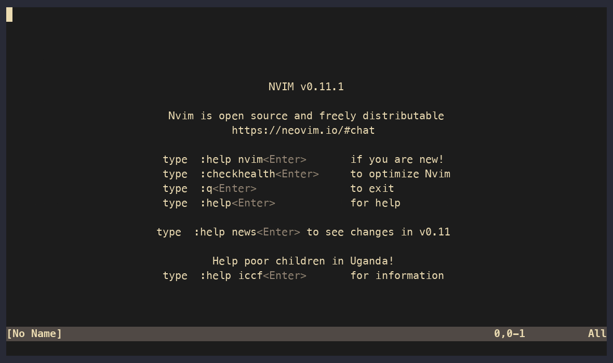

# parole.nvim

[](https://github.com/sameigen/parole.nvim/actions/workflows/ci.yml)


> Every fugitive eventually comes up for parole.



A GitHub pull-request board for Neovim, built around the
[vim-fugitive](https://github.com/tpope/vim-fugitive) workflow. One keymap
opens a cross-repo dashboard of every PR that involves you; from there you can
read the full case file, deliver a verdict, drop into a real worktree for deep
review, or dispatch a coding agent at it.

parole.nvim deliberately does **not** reimplement inline review — it composes
with the tools that already do that well
([octo.nvim](https://github.com/pwntester/octo.nvim),
[diffview.nvim](https://github.com/sindrets/diffview.nvim)) and focuses on what
was missing: the cross-repo triage surface, honest worktree checkouts, and
agent dispatch.

## Features

- **The Board** (`:Parole`) — open PRs across all your orgs/repos, grouped by
  *awaiting your verdict* / *your cases* / *involved*, with live checks and
  review state. Auto-refreshes while visible.
- **Case files** (`:Parole owner/repo#123`) — a PR as a readable markdown
  buffer: metadata, failing checks, body, reviews, and review threads.
- **Verdicts** — approve, request changes, comment, and reply to review
  threads without leaving the buffer (via `gh`).
- **Deep review** — fetch the PR into a managed git worktree and open
  diffview/fugitive against the merge base. Real files, working LSP.
- **Agent dispatch** — create a worktree for a PR (or a fresh branch of the
  current repo with `:ParoleAgent`), type the context you want preloaded, and
  drop into [Claude Code](https://claude.com/claude-code) — interactive in a
  terminal tab, or headless.
- **Picker** (`:ParolePick`) — fzf-lua over every PR on the board.

## Requirements

- Neovim **0.11+**
- [`gh`](https://cli.github.com) (authenticated)
- Optional: [fzf-lua](https://github.com/ibhagwan/fzf-lua) (picker),
  [octo.nvim](https://github.com/pwntester/octo.nvim) (inline review handoff),
  [diffview.nvim](https://github.com/sindrets/diffview.nvim) (deep review),
  [render-markdown.nvim](https://github.com/MeanderingProgrammer/render-markdown.nvim)
  (prettier case files), `claude` (agent dispatch)

## Installation

[lazy.nvim](https://github.com/folke/lazy.nvim):

```lua
{
  "sameigen/parole.nvim",
  cmd = { "Parole", "ParolePick", "ParoleAgent" },
  opts = { owners = { "your-org" } },
}
```

`vim.pack` (Neovim 0.12+):

```lua
vim.pack.add({ { src = "https://github.com/sameigen/parole.nvim" } })
require("parole").setup({ owners = { "your-org" } })
```

`setup()` is optional — everything works with defaults.

## Configuration

```lua
require("parole").setup({
  -- scope searches to these owners; {} searches everywhere you're involved
  owners = {},
  -- where your local clones live (scanned two levels deep)
  roots = { "~/Code" },
  -- where managed worktrees are created
  worktree_dir = vim.fn.stdpath("cache") .. "/parole/worktrees",
  -- board auto-refresh in seconds; 0 disables
  refresh_interval = 300,
  -- max PRs per board section
  limit = 50,
  -- agent dispatch: named profiles, levers off by default
  agent = {
    use = "claude",   -- which profile dispatches
    yolo = false,     -- pull deliberately: agent runs with NO permission checks
    auto = false,     -- agent auto-accepts edits
    profiles = {
      claude = {
        cmd = { "claude" },
        headless = { "-p", "--output-format", "text" },
        yolo_flags = { "--dangerously-skip-permissions" },
        auto_flags = { "--permission-mode", "auto" },
      },
      -- add codex/pi/etc. with their own flag spellings; set use = "codex"
    },
  },
  -- buffer-local keymaps; set any action to false to disable it
  keymaps = {
    board = {
      open_case = "<CR>",
      diff = "v",
      octo = "o",
      deep_review = "D",
      agent = "a",
      agent_headless = "A",
      browse = "gx",
      refresh = "r",
      close = "q",
    },
    case = {
      approve = "a",
      request_changes = "x",
      comment = "c",
      reply = "R",
      diff = "v",
      deep_review = "D",
      octo = "o",
      browse = "gx",
      refresh = "r",
      close = "q",
    },
  },
})
```

## Keymaps

No global keymaps are installed. Press `?` in any parole buffer for a popup
of everything active there. Every key is configurable via `keymaps` above
(`false` disables), and every action also ships as `<Plug>(parole-<action>)`
(e.g. `<Plug>(parole-deep-review)`) for mapping from anywhere.

Defaults — board:

| key | action |
|-----|--------|
| `<CR>` | open the case file |
| `v` | quick diff (full patch, folded per file) |
| `K` | the full charge: untruncated title float |
| `o` | octo.nvim inline review |
| `D` | deep review: worktree + diffview vs merge base |
| `a` / `A` | agent in a worktree (interactive / headless) |
| `gx` / `r` / `q` / `?` | browser / refresh / close / help |

Case file adds: `a` approve · `x` request changes · `c` comment · `R` reply
to thread under cursor · `gf` open the thread's file in a worktree.

Quick diff (`v`): `c` comment on the line under the cursor · `gf` open that
file/line in a worktree · `q` close.

Suggested global maps:

```lua
vim.keymap.set("n", "<leader>gr", "<cmd>Parole<CR>")
vim.keymap.set("n", "<leader>gR", "<cmd>ParolePick<CR>")
```

## Agent sessions

`a` dispatches interactively (full agent TUI in a terminal tab); `A` runs
headless **in the background** — no tab, you get a notification when it
finishes and its report lands in a markdown buffer. Sessions of both kinds
appear on the board as **AGENTS ON DUTY** — `<CR>` jumps into the TUI or
opens the report; closing a tab hides, it never kills. Dispatching on a PR with a live session jumps to it instead of
spawning a twin.

Every finished session is recorded to `stdpath("state")/parole/agents/` and
shows on the board under **CASE HISTORY** (survives nvim restarts): `<CR>`
reopens the report, `X` expunges it — output file and, on confirm, the
worktree. Inside a session: Esc belongs to the agent (interrupt /
rewind), `<C-q>` or `<C-\><C-n>` leaves terminal mode, `<C-h/j/k/l>` moves
between windows. Suggested global map:

```lua
vim.keymap.set({ "n", "t" }, "<C-,>", function() require("parole.agent").toggle_last() end)
```

## Housekeeping

Worktrees share the parent clone's git objects — the disk cost is the
checkout plus anything agents install into it. Worktrees for merged/closed
PRs are swept automatically when the board opens. `:ParoleClean` removes the
rest (skips trees with uncommitted changes; `:ParoleClean!` forces).
`:checkhealth parole` verifies the environment and warns when the yolo
lever is on.

## Credits

Named in the spirit of tpope's fugitive. Standing on the shoulders of `gh`,
octo.nvim, diffview.nvim, and gh-dash.

## License

MIT
